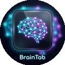
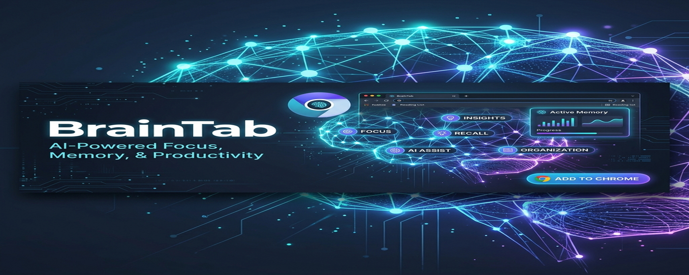
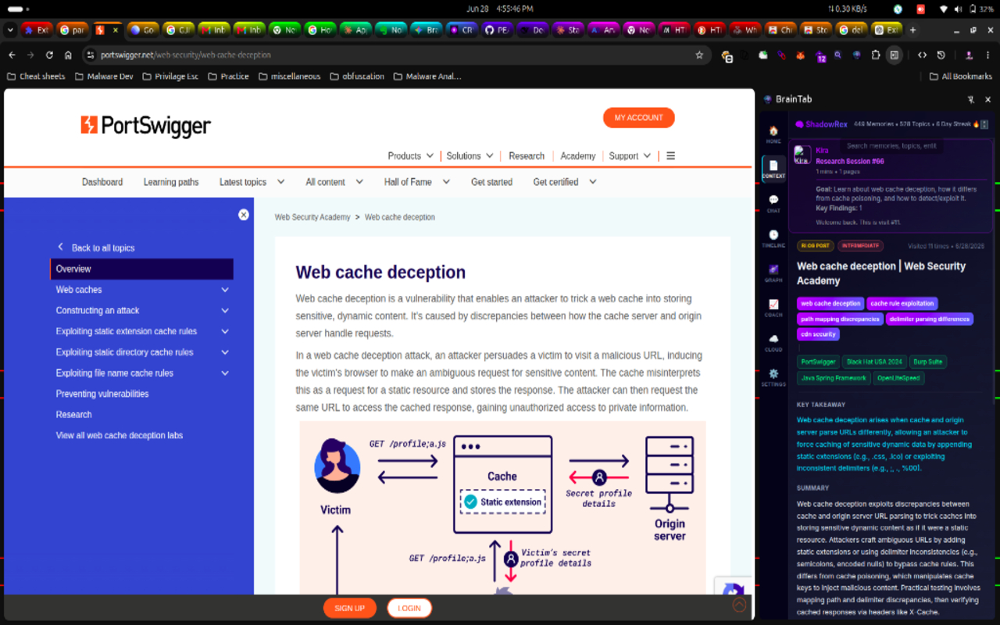
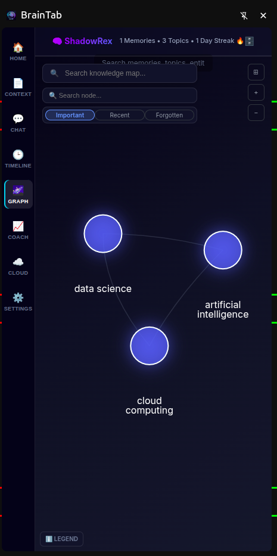

  

  # 🧠 BrainTab

  

  

  

    
  

  

    <b>BrainTab</b> is an AI-powered Chrome extension that automatically remembers, summarizes, and connects everything you read into an intelligent, interactive knowledge graph.
  

## 🚀 The Problem
Information overload is real. You leave 50 tabs open because you don't want to lose them, or you bookmark articles you never read. When you need that specific piece of information from three weeks ago, it's completely lost in your browser history.

## 💡 The Solution
**Frictionless Knowledge Management.** 
Install BrainTab and browse normally. Our AI silently reads, understands, and extracts the core concepts from your tabs, building a personal, highly searchable database of your mind.

## 🔥 Core Features

### 🤖 Meet Kira: Your Persistent AI Copilot
Stop switching tabs to use ChatGPT. Kira lives in your side panel, follows you across websites, and knows exactly what page you are reading. Ask her to explain complex topics, summarize long articles, or retrieve past memories instantly.

  

### 🌌 Visual Knowledge Graph
Experience your knowledge like never before. BrainTab connects related concepts and visualizes your research in a beautiful, interactive GraphQL interface. See how your thoughts connect in real-time.

  

### ⚡ Automatic Summarization & Tagging
Never manually tag a bookmark again. As you browse, BrainTab automatically generates concise summaries and extracts key entities (tools, concepts, people) from the page.

---

  <i>Built with ❤️ for deep thinkers and researchers.</i>

